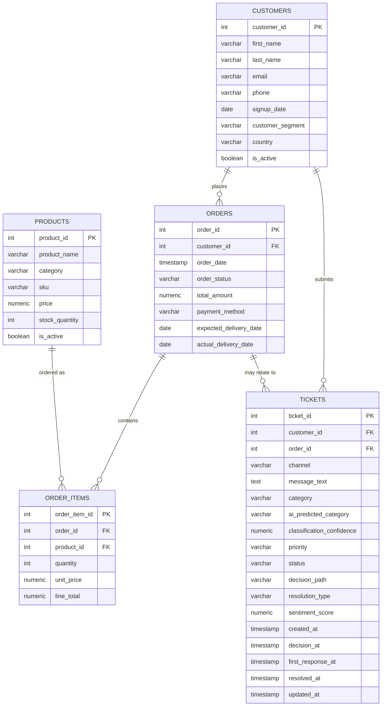
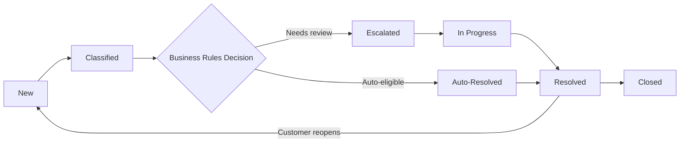

# Phase 1: Business Problem & Data Design
**Project:** AI-Powered Customer Support Automation System
**Phase:** 1 of N — Business Problem & Data Design
**Status:** Draft for review — no code, models, or dashboards built yet

---

## 1. Fictional Company

| Attribute | Detail |
|---|---|
| **Name** | Meridian Commerce |
| **Industry** | E-commerce / general merchandise retail |
| **Business model** | Online-only, direct-to-consumer (D2C) retailer. Sells owned inventory (not a marketplace) across six categories: Electronics Accessories, Home & Kitchen, Sports & Outdoors, Beauty & Personal Care, Office & Stationery, and Toys & Games. Ships via third-party logistics partners. |
| **Description** | Founded in 2019, Meridian Commerce has grown into a mid-sized online retailer known for fast shipping and a broad accessory/lifestyle catalog. It sells through its website and a mobile app, with customer support handled via email, live chat, and phone. |
| **Approximate scale** | ~250,000 registered customers · ~8,000 active SKUs · ~40,000–45,000 orders/month · ~10,000–12,000 support tickets/month · ~35 support agents |

This is the *narrative* scale of the fictional company — it's used to justify the business problem and objectives below. The actual dataset we generate for the MVP will be much smaller (Section 10).

---

## 2. Business Problem

**Current situation.** Meridian Commerce's support ticket volume has grown roughly 60% year-over-year, while support headcount has grown only about 15%. Every ticket is currently triaged manually: an agent reads the message, decides on a category and priority, searches two separate systems (order management + CRM) to verify the customer/order details, and only then decides how to respond.

**Why manual support is inefficient.**
- Repetitive, low-complexity requests (order status checks, standard within-policy refunds, delivery-delay updates) consume the same amount of agent time as complex ones, even though they follow predictable rules.
- Manual categorization is inconsistent — different agents label similar issues differently, which quietly corrupts reporting and makes trend analysis unreliable.
- Verifying customer/order data by hand across systems slows down first response and resolution time.
- Support leadership has no real-time visibility into ticket trends, category-level performance, or emerging issues (e.g., a spike in "Damaged Product" tickets tied to one SKU, which could signal a QC problem).
- The result: slower response and resolution times, rising cost per ticket, inconsistent customer experience, backlog during peak sales periods, and difficulty forecasting staffing needs.

**What the system will improve.** An AI-assisted pipeline that classifies each incoming message, extracts structured identifiers, verifies them against the database, applies consistent business rules, and either auto-resolves the ticket or routes it to a human — while drafting a response either way. This standardizes categorization, shortens the path to first response, frees agents to focus on judgment-heavy cases, and produces clean, structured data for a Power BI reporting layer.

---

## 3. Business Objectives

1. Reduce the manual triage effort required per incoming ticket.
2. Increase the share of tickets that can be safely auto-resolved under defined business rules, without sacrificing accuracy.
3. Standardize ticket categorization so operational reporting is reliable and comparable over time.
4. Shorten average time-to-first-response and time-to-resolution.
5. Give support leadership real-time visibility into support operations through Power BI.
6. Build a measurable foundation for estimating support cost savings as automation scales.

---

## 4. Key Performance Indicators (KPIs)

All figures below are **definitions and measurement approaches**, not results — nothing has been tested yet, so no KPI has a claimed value. Where a "target" is mentioned, it is a business goal to validate later, not a measured outcome.

| KPI | Definition | How it will be measured | Target / status |
|---|---|---|---|
| **Ticket volume** | Number of tickets received per period, by category/priority/channel | `COUNT(*)` from `tickets`, grouped by time period and dimension | Trend metric — no fixed target, used for staffing and load monitoring |
| **Classification accuracy** | % of tickets where the AI-predicted category matches the confirmed category | `COUNT(ai_predicted_category = category) / COUNT(*)` over tickets with a confirmed label | Goal only; actual value to be established once the classifier is built and tested (Phase 3+) |
| **Automation rate** | % of tickets routed down the automated path | `COUNT(decision_path = 'Automated') / COUNT(*)` | Goal only; realistic starting range (e.g., 30–40% of eligible categories) to be validated once business rules are defined |
| **Human review rate** | % of tickets routed to a human | Complement of automation rate | Tracked alongside automation rate |
| **Average processing time** | Time from ticket creation to the system's automate/escalate decision | `AVG(decision_at - created_at)` | Goal: minimize; no baseline yet |
| **Average resolution time** | Time from ticket creation to resolution, tracked **separately** for automated vs. human-assisted tickets | `AVG(resolved_at - created_at)` grouped by `resolution_type` | Goal: reduce vs. current manual baseline (baseline not yet measured) |
| **Customer sentiment** | Sentiment of the customer's message and, ideally, of any follow-up | `AVG(sentiment_score)` overall and by category/time | Goal: maintain or improve as automation increases |
| **Estimated cost savings** | Agent time saved by automation, valued at a cost-per-ticket assumption, net of system operating cost | `(tickets automated × assumed manual cost per ticket) − (LLM/infra cost)` | Not computable yet — requires a defined agent cost-per-ticket assumption, planned for the analytics phase |

**Supporting/secondary metrics** worth tracking alongside the above: first response time, SLA compliance rate, reopened-ticket rate, and a "false automation rate" (auto-resolved tickets later reopened) as a quality/risk check on the automation logic.

---

## 5. Conceptual Database Design

### 5.1 Entity-Relationship Overview

### 5.2 Table Definitions

#### `customers`
| Column | Type | Description | Key |
|---|---|---|---|
| customer_id | SERIAL | Unique customer identifier | PK |
| first_name | VARCHAR(50) | Customer's first name | |
| last_name | VARCHAR(50) | Customer's last name | |
| email | VARCHAR(100) | Email address, unique | |
| phone | VARCHAR(20) | Contact phone number | |
| signup_date | DATE | Account creation date | |
| customer_segment | VARCHAR(20) | Business segment: New / Returning / VIP | |
| country | VARCHAR(50) | Country of residence | |
| is_active | BOOLEAN | Whether the account is active | |

#### `products`
| Column | Type | Description | Key |
|---|---|---|---|
| product_id | SERIAL | Unique product identifier | PK |
| product_name | VARCHAR(150) | Product name | |
| category | VARCHAR(50) | Product category | |
| sku | VARCHAR(30) | Stock-keeping unit code, unique | |
| price | NUMERIC(10,2) | Current listed price | |
| stock_quantity | INT | Units currently in inventory | |
| is_active | BOOLEAN | Whether the product is currently sellable | |

#### `orders`
| Column | Type | Description | Key |
|---|---|---|---|
| order_id | SERIAL | Unique order identifier | PK |
| customer_id | INT | Customer who placed the order | FK → customers.customer_id |
| order_date | TIMESTAMP | When the order was placed | |
| order_status | VARCHAR(20) | Current order status | |
| total_amount | NUMERIC(10,2) | Total order value | |
| payment_method | VARCHAR(20) | Payment method used | |
| expected_delivery_date | DATE | Estimated delivery date | |
| actual_delivery_date | DATE, nullable | Actual delivery date (null until delivered) | |

#### `order_items`
| Column | Type | Description | Key |
|---|---|---|---|
| order_item_id | SERIAL | Unique line-item identifier | PK |
| order_id | INT | Parent order | FK → orders.order_id |
| product_id | INT | Product ordered | FK → products.product_id |
| quantity | INT | Units of this product in the order | |
| unit_price | NUMERIC(10,2) | Price per unit at time of order (may differ from current product price) | |
| line_total | NUMERIC(10,2) | quantity × unit_price, stored for reporting convenience | |

#### `tickets`
| Column | Type | Description | Key |
|---|---|---|---|
| ticket_id | SERIAL | Unique ticket identifier | PK |
| customer_id | INT | Customer who submitted the ticket | FK → customers.customer_id |
| order_id | INT, nullable | Related order, if any | FK → orders.order_id |
| channel | VARCHAR(20) | Contact channel | |
| message_text | TEXT | Raw customer message | |
| category | VARCHAR(30) | Final/confirmed ticket category | |
| ai_predicted_category | VARCHAR(30), nullable | Category predicted by the LLM classifier | |
| classification_confidence | NUMERIC(4,3), nullable | LLM confidence score (0–1) | |
| priority | VARCHAR(10) | Priority level | |
| status | VARCHAR(20) | Current ticket status | |
| decision_path | VARCHAR(15), nullable | Automated / Human Review — initial routing decision | |
| resolution_type | VARCHAR(15), nullable | Automated / Human / Hybrid — how it was actually resolved | |
| sentiment_score | NUMERIC(3,2), nullable | AI-derived sentiment of the message (-1.00 to 1.00) | |
| created_at | TIMESTAMP | Ticket creation time | |
| decision_at | TIMESTAMP, nullable | When the automate/escalate decision was made | |
| first_response_at | TIMESTAMP, nullable | When the customer received a first response | |
| resolved_at | TIMESTAMP, nullable | When the ticket was resolved | |
| updated_at | TIMESTAMP | Last update time | |

### 5.3 Relationships

- **customers → orders** (1:N): one customer can place many orders.
- **customers → tickets** (1:N): one customer can submit many tickets.
- **orders → order_items** (1:N): one order contains many line items.
- **products → order_items** (1:N): one product appears across many order line items.
- **orders → tickets** (0:N, nullable FK): a ticket *may* relate to a specific order, and one order can have zero, one, or several tickets (e.g., separate tickets for a delayed item and a damaged item on the same order). Some ticket categories (Account Problem, general Product Question, Other) legitimately have no order at all, which is why `order_id` is nullable on `tickets` rather than required.
- `order_items` is the associative table resolving the many-to-many relationship between `orders` and `products`, carrying the quantity and price at time of purchase.

---

## 6. Ticket Categories

1. Refund Request
2. Missing Item
3. Damaged Product
4. Delivery Delay
5. Order Status Inquiry
6. Product Question
7. Payment Problem
8. Account Problem
9. Complaint
10. Other

---

## 7. Priority Levels

| Priority | Criteria |
|---|---|
| **Low** | General product questions, non-urgent order status checks — no financial or time-sensitive impact |
| **Medium** | Delivery delays, standard refund requests within policy, minor order discrepancies |
| **High** | Damaged products, missing items, payment problems — direct financial impact or repeated inconvenience |
| **Urgent** | Suspected fraud/security issues, high-value orders with unresolved payment or delivery problems, or messages with strong negative sentiment / explicit escalation language |

---

## 8. Ticket Statuses & Lifecycle

| Status | Meaning |
|---|---|
| New | Received, not yet processed |
| Classified | AI has assigned a predicted category and extracted structured data |
| Auto-Resolved | Business rules allowed automatic processing; closed without human involvement |
| Escalated | Flagged for human review per business rules |
| In Progress | A human agent is actively working the ticket |
| Pending Customer | Waiting on more information from the customer |
| Resolved | Issue addressed, awaiting closure |
| Closed | Fully closed |
| Reopened | Customer responded after resolution indicating the issue persists |

---

## 9. Data Dictionary — Controlled Vocabularies

| Field | Allowed values |
|---|---|
| `customers.customer_segment` | New, Returning, VIP |
| `orders.order_status` | Placed, Processing, Shipped, Out for Delivery, Delivered, Delayed, Cancelled, Returned, Refunded |
| `orders.payment_method` | Credit Card, Debit Card, PayPal, Apple Pay, Google Pay, Gift Card, Bank Transfer |
| `tickets.channel` | Email, Chat, Phone, Social Media, Contact Form |
| `tickets.category` / `tickets.ai_predicted_category` | Refund Request, Missing Item, Damaged Product, Delivery Delay, Order Status Inquiry, Product Question, Payment Problem, Account Problem, Complaint, Other |
| `tickets.priority` | Low, Medium, High, Urgent |
| `tickets.status` | New, Classified, Auto-Resolved, Escalated, In Progress, Pending Customer, Resolved, Closed, Reopened |
| `tickets.decision_path` | Automated, Human Review |
| `tickets.resolution_type` | Automated, Human, Hybrid |

(The full column-level data dictionary is the set of table definitions in Section 5.2 — type, description, and key for every field.)

---

## 10. Recommended MVP Dataset Size

| Entity | Recommended count | Rationale |
|---|---|---|
| Customers | 1,000 | Large enough for segment- and cohort-style analysis, small enough to generate and query comfortably |
| Products | 150 | ~25 per category across the 6 categories, enough variety for realistic order composition |
| Orders | 4,000 | ~4 orders/customer, a reasonable repeat-purchase pattern over a multi-month analysis window |
| Order items | ~9,500 | ~2.4 items/order, a typical basket size |
| Support tickets | 1,500 | ~150 per category on average — enough volume per category to compute a meaningful classification accuracy and support BI breakdowns, without generating (and later, LLM-processing) an unnecessarily large volume during development |

**Note on the ticket-to-order ratio:** 1,500 tickets against 4,000 orders implies a ~37% contact rate, noticeably higher than the ~5–20% typically cited for real-world e-commerce support. This is a deliberate MVP choice, not a realism claim: at a realistic contact rate, low-frequency categories like Account Problem or Payment Problem would end up with too few rows in a small dataset to analyze meaningfully. The ratio can be tuned down (with a larger order volume) later if closer real-world proportions become important.

---

## 11. Key Design Decisions

- **`order_id` is nullable on `tickets`** because several categories (Account Problem, general Product Question, Other) don't necessarily reference a specific order.
- **`category` and `ai_predicted_category` are separate fields** so that classification accuracy can be measured directly by comparing the two, rather than only ever storing one "final" label.
- **`decision_at`, `first_response_at`, and `resolved_at` are separate timestamps** on `tickets` so that "processing time" (system decision latency) and "resolution time" (full lifecycle) can be measured independently, and resolution time can be split by `resolution_type`.
- **No `agents` table in this MVP** — the five entities requested (customers, orders, products, order_items, tickets) are sufficient for Phase 1's scope. Agent-level tracking (workload, individual performance) is a reasonable future extension but is intentionally left out for now.
- **No separate `refunds` table** — refund actions are captured at the `tickets` + `orders.order_status` level for the MVP. A dedicated transactions/refunds table could be introduced later if deeper financial reconciliation is needed.

---

## 12. Assumptions & Out of Scope for Phase 1

- Single currency (USD) and a simplified single-market context, for Phase 1 simplicity.
- The dataset will be synthetically generated in a later phase — no real customer data is involved.
- KPI "targets" mentioned above are directional business goals only; no performance numbers have been tested or claimed.
- Per your instructions, this phase includes **no Python code, no SQL DDL/DML, no AI classifier, no API, and no Power BI dashboard** — those are reserved for later phases.

---

## Phase 1 Complete — Checklist

- [x] Fictional company defined (name, industry, business model, description, scale)
- [x] Business problem defined (pain points, why manual support is inefficient, what improves)
- [x] Business objectives defined
- [x] KPIs defined (ticket volume, classification accuracy, automation rate, human review rate, avg. processing time, avg. resolution time, customer sentiment, estimated cost savings, plus supporting metrics)
- [x] Conceptual database design completed for `customers`, `orders`, `products`, `order_items`, `tickets` (columns, types, descriptions, PKs, FKs)
- [x] Table relationships explained
- [x] Ticket categories defined (10 categories)
- [x] Priority levels defined with criteria
- [x] Ticket statuses and lifecycle defined
- [x] Data dictionary / controlled vocabularies documented
- [x] MVP dataset size recommended, with rationale
- [x] No code, models, or dashboards built — confirmed

**Ready for your review before Phase 2.**
